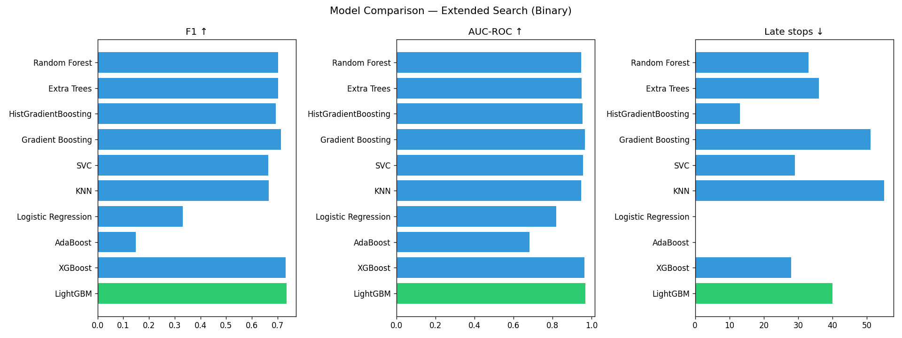
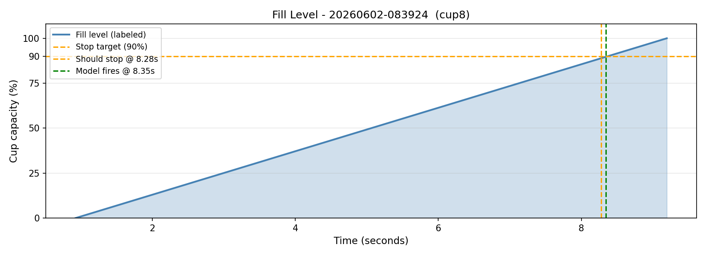
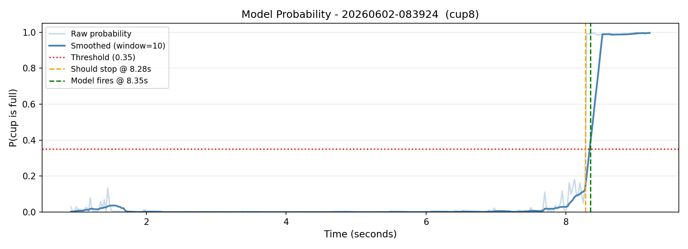
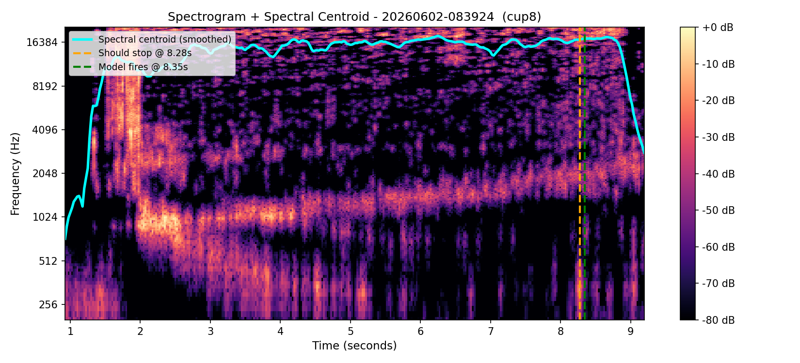

# 🥤 Acoustic Cup-Fill Detection

An automated machine learning system capable of determining the optimal moment to stop pouring water into a cup using only passive acoustic sensing (audio signals) — no cameras, no weight sensors, just sound.

---

## 📖 Overview

When water is poured into a cup, the acoustic resonance of the vessel changes as the water level rises. This project captures those changes using a microphone, extracts audio features, and trains a classifier to distinguish between "not full" and "nearly full" states.

Submitted as a Machine Learning course project at **Sami Shamoon College of Engineering (SCE)**, Department of Electrical and Electronics Engineering.

**Lecturer:** Dmitry Bakhovsky  
**Authors:** Tomer Nur Milkov, Nikita Budovski, Oren, Or

---

## ⚙️ How It Works

Our system operates through a sequential pipeline:
1. **Record & Clean:** Capture liquid pouring audio, applying non-stationary noise profiling to strip out ambient faucet/pump hums.
2. **Trim & Frame:** Isolate the true boundaries of the pour event automatically, slicing signal streams into highly responsive 50ms frames with a 50% overlap.
3. **Extract Transient Features:** Map frequencies within the 1000Hz - 8000Hz band to compute 13 MFCCs alongside their velocity ($\Delta$) and acceleration ($\Delta^2$) derivatives.
4. **Train & Tune Gradient Boosters:** Train a LightGBM binary classifier via optimized parameter search using GroupKFold cross-validation to recognize the final $\ge 90\%$ capacity point.
5. **Real-Time Guardrails:** Run model probability projections through a 10-frame causal moving average to prevent immediate splash artifacts from triggering early faucet closures.

---

## 🗂️ Dataset

- **120 recordings** across 8 cup types.
- **Cup materials:** Glass, Plastic, Cardboard.
- **~15 recordings per cup type** for balanced representation.
- **1,495 samples** total after windowing.

Recordings were made under consistent conditions: same room, same tap, fixed microphone distance, and a quiet environment.

---

## 🎛️ Features Extracted

For each 50ms audio frame, the pipeline concentrates feature extraction inside the primary liquid resonance passband (1000 Hz to 8000 Hz):

| Feature | Description |
|---|---|
| **MFCC (×13)** | Mel-frequency cepstral coefficients — capture timbral/spectral shape |
| **RMS Energy** | Loudness / signal power |
| **Zero Crossing Rate** | How often the signal crosses zero — relates to frequency content |
| **Spectral Centroid** | "Center of gravity" of the frequency spectrum |
| **Spectral Bandwidth** | Spread of energy around the centroid |
| **Spectral Rolloff** | Frequency below which 85% of energy falls |

**Total: 56 features per sample (including dynamic delta/delta2 differentials and spectral contrast bands)**

---

## 🧠 Models Evaluated

All models were evaluated with **GroupKFold Cross-Validation** (5 folds), grouping by recording file to prevent window leakage. Models were optimized to balance micro-latency against false-positive premature stops.

| Model | Precision | Recall | F1-Score | AUC-ROC | Avg Latency ($\Delta t$) |
| :--- | :---: | :---: | :---: | :---: | :---: |
| **LightGBM** | **78.11%** | **97.62%** | **0.868** | **0.961** | **+0.08 s** |
| Random Forest | 67.81% | 73.06% | 0.703 | 0.947 | -1.90 s |
| Extra Trees | 68.34% | 72.37% | 0.702 | 0.949 | -1.76 s |
| HistGradientBoosting | 60.92% | 80.49% | 0.692 | 0.955 | -2.19 s |

*Note: LightGBM vastly outperforms classical configurations due to gradient-based one-side sampling, achieving an exceptionally high recall (97.62%), meaning it almost never misses a true full event, while maintaining a remarkably precise stop latency.*
---

## 🔍 Feature Ablation & Importance

Ablation analysis (`ablation_results.csv`) confirmed that modeling the **temporal velocity** of the acoustic change is crucial:
- **All Features (56):** F1 = **0.868**, AUC-ROC = **0.961**
- **No Delta/Delta-Delta (28):** F1 = 0.585, AUC-ROC = 0.932
- **MFCC Baseline Only (19):** F1 = 0.573, AUC-ROC = 0.911

This proves that the classifier is tracking the *dynamic path* of the Helmholtz resonance shift as the physical empty volume of the cup contracts, rather than static volume thresholds.

The top feature groups driving the LightGBM decisions are visualized in `images/feature_importance_LightGBM.png`.
---

## 📂 Project Structure

```text
.
├── data/
│   ├── raw/                   # Raw .wav recordings
│   ├── clean/                 # Noise-reduced audio files
│   └── features_labeled.csv   # Final extracted dataset
│
├── src/                       # Python pipeline scripts
│   ├── whitenoise.py          # Step 1: Applies non-stationary noise reduction
│   ├── label_and_extract.py   # Step 2: Extracts targeted MFCCs & derivatives
│   ├── tune_models.py         # Step 3: Trains & tunes LightGBM / XGBoost
│   ├── plot_prediction.py     # Step 4: Visualizes real-time moving averages
│   └── plot_spectrogram.py    # Step 5: Visualizes Helmholtz resonance
│
├── models/                    # Model binary and tuning performance metrics
│   ├── best_model.pkl         # Saved production LightGBM pipeline
│   ├── results_summary.csv    # Cross-validation performance comparisons
│   ├── results_extended.csv
│   └── ablation_results.csv   # Feature contribution and ablation analysis
│
├── images/                    # Visual assets rendered in documentation
│   ├── 01_fill_level.png
│   ├── 02_probability.png
│   ├── 03_spectrogram_centroid.png
│   ├──model_comparison.png
│   ├──feature_importance_LightGBM.png
│   └── feature_importance_Gradient_Boosting.png
│
├── docs/                      # Project reports and documentation
│   ├── lab_report.docx        # English Laboratory Report
│   ├── ML_Report_Hebrew.pdf   # Final Project Report (Hebrew)
│   └── documantation.docx     # Internal engineering logic
│
├── .gitignore
├── requirements.txt
└── README.md
```
---

## 🚀 Setup & Usage

### Requirements
Ensure you have Python 3.10+ installed, then install the required dependencies:

```bash
pip install -r requirements.txt
```
### Running the Pipeline
Place your raw `.wav` recordings inside `data/raw/` (organized by cup folders), then run the scripts from the root directory in sequential order:

**1. Clean Background Noise**
```bash
python src/whitenoise.py
```

**2. Extract & Label Features**
```bash
python src/label_and_extract.py
```

**3. Train & Tune Models**
```bash
python src/tune_models.py
```

**4. Generate Prediction Dashboards**
```bash
python src/plot_prediction.py
```
**5. Visualize Acoustic Resonance**
```bash
python src/plot_spectrogram.py
```

---

## 📊 Key Findings

- **Acoustic-only detection works.** A LightGBM classifier achieves an F1-Score of 0.868, accurately triggering a stop command with an average latency of just +0.08 seconds.
- **Spectral shape is key.** The spectral centroid and MFCC derivatives track the Helmholtz resonance, proving the model relies on physical acoustic shifts rather than just volume.
- **Physical Smoothing is essential.** Applying a rolling causal average and enforcing monotonicity prevents sudden splashing noises from triggering false-positive stops.
- **GroupKFold prevents leakage.** Without grouping by recording, windows from the same recording appear in both train and test sets, artificially inflating scores.

---

### Visualizing Model Performance






---

## 🔮 Future Improvements
- Larger, more diverse dataset (more cup types, sizes, materials).
- Data augmentation with background noise to improve robustness in active environments.
- Real-time streaming implementation for embedded hardware deployment.
- Online adaptation to new cup types using few-shot learning.
